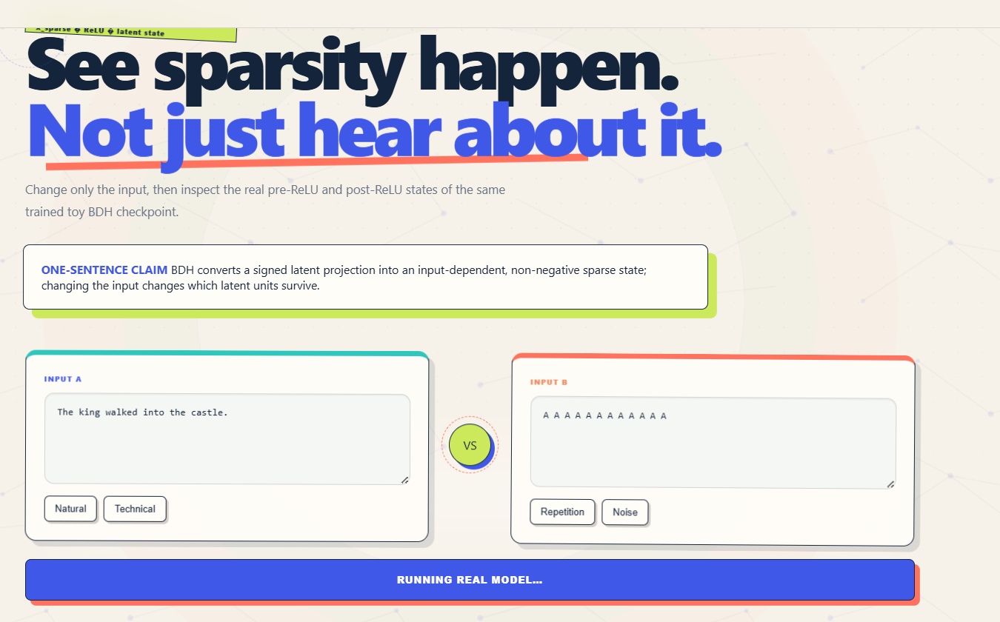

# Inside BDH — See Sparsity Happen

<p align="center">
  <b>Change the input. Keep the checkpoint fixed. Watch BDH's sparse internal state change.</b>
</p>

<p align="center">
  <a href="https://inside-bdh-jm7d.onrender.com"><b>🌐 Live Demo</b></a>
  &nbsp;•&nbsp;
  <a href="https://inside-bdh1.onrender.com"><b>⚙️ Backend API</b></a>
  &nbsp;•&nbsp;
  <a href="https://github.com/himani27301/inside-bdh"><b>💻 Repository</b></a>
</p>

---

## ✨ Project Preview



**Inside BDH** is an interactive educational artifact for exploring one specific mechanism inside a Dragon Hatchling (BDH) model:

> **BDH converts a signed latent projection into an input-dependent, non-negative sparse state; changing the input changes which latent units survive.**

Instead of only reading about sparsity, the learner changes the input and inspects the model's **real intermediate states layer-by-layer**.

---

## 🎯 What Problem Are We Solving?

Sparse neural computation is usually explained through equations, research papers, or static diagrams.

That makes it difficult for a learner to understand what is **actually happening inside the model** when an input changes.

Inside BDH converts that abstract idea into an interactive experiment.

The learner can:

1. Choose two different input sequences
2. Keep the same trained checkpoint
3. Run both inputs through the model
4. Compare their internal sparse states
5. Inspect which latent units survive
6. Observe the effect of ReLU
7. Compare activity across layers
8. Test their understanding using a small challenge

The most important experimental idea is:

> **The model stays fixed. Only the input changes.**

That makes it easier to observe how the internal computation changes because of the input itself.

---

## 🧪 What Can the Learner Inspect?

### 1. Same Checkpoint, Different Input

Both Input A and Input B are processed using the **same trained toy BDH checkpoint**.

This means the learner is not comparing two different models.

They are comparing:

```text
Same Model
   +
Different Input
   ↓
Different Internal State
