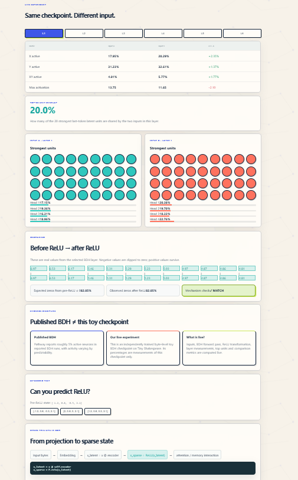
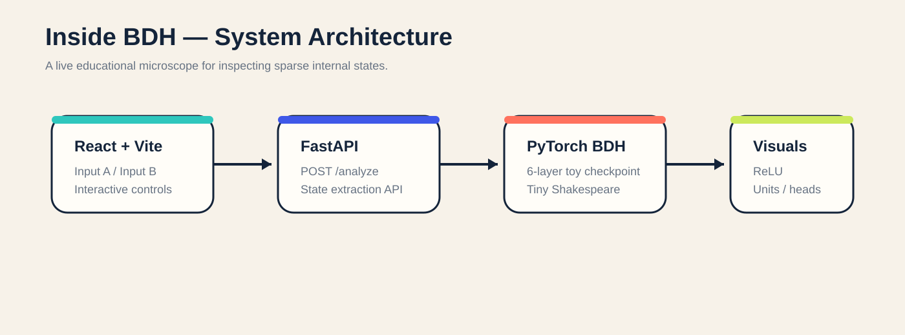

# Inside BDH - See Sparsity Happen

<p align="center">
  <b>Change the input. Keep the checkpoint fixed. Watch BDH's sparse internal state change.</b>
</p>

<p align="center">
  <a href="https://inside-bdh-jm7d.onrender.com"><b>Live Demo</b></a>
  &nbsp;|&nbsp;
  <a href="https://inside-bdh1.onrender.com"><b>Backend API</b></a>
  &nbsp;|&nbsp;
  <a href="https://github.com/himani27301/inside-bdh"><b>Repository</b></a>
</p>

---

## Project Preview


**Inside BDH** is an interactive educational artifact for exploring one specific mechanism inside a Dragon Hatchling (BDH) model:

> **BDH converts a signed latent projection into an input-dependent, non-negative sparse state; changing the input changes which latent units survive.**

Instead of only reading about sparsity, the learner changes the input and inspects the model's **real intermediate states layer by layer**.

---

## What Problem Are We Solving?

Sparse neural computation is often explained through equations, papers, or static diagrams. That makes it difficult to build intuition for what actually changes inside a model when the input changes.

Inside BDH turns that idea into a controlled interactive experiment:

1. Choose two input sequences.
2. Keep the same trained checkpoint fixed.
3. Run both inputs through the model.
4. Compare the internal sparse states.
5. Inspect which latent units survive.
6. Observe the effect of ReLU.
7. Compare activity across layers.
8. Test understanding with a small ReLU challenge.

The key experimental idea is simple:

> **The model stays fixed. Only the input changes.**

That makes it easier to observe how the internal computation changes because of the input itself.

---

## What Can the Learner Inspect?

### Same checkpoint, different input

Both Input A and Input B are processed using the same trained toy BDH checkpoint. The learner is therefore comparing two model runs with different inputs, not two different models.

```text
Same model
    +
Different input
    |
    v
Different internal state
```

### Six BDH layers

The learner can switch between all six BDH layers. For each layer, the interface exposes measurements including:

- X sparse activity
- Y sparse activity
- XY interaction activity
- maximum activation
- strongest latent units
- head-level activity
- overlap between strongest units

### Sparse activity

The application visualizes the percentage of active units in the model's sparse state instead of showing only a final output.

```text
Input
  |
  v
BDH layer
  |
  v
Sparse latent state
  |
  +-- active units
  +-- zeroed units
```

Changing the input can change which units remain active.

### Strongest latent units

Inside BDH identifies the strongest latent activations for each input and visualizes them as units. This makes it possible to compare the most active units in Input A and Input B.

The visualization does not claim that an individual unit has a specific semantic meaning. It only exposes which units have the strongest activity for that run.

### Top-unit overlap

The application measures how many of the strongest latent units are shared between the two inputs. A lower overlap helps make the input-dependent change in sparse state visible.

### Head activity

The interface also exposes activity across the model's heads so the learner can compare how different parts of the model respond to Input A and Input B.

---

## Before ReLU -> After ReLU

One of the main educational sections shows what happens before and after ReLU.

```text
ReLU(x) = max(0, x)
```

So:

```text
Negative value -> 0
Positive value -> remains positive
```

Example:

```text
Before ReLU: -0.82
After ReLU:   0
```

```text
Before ReLU:  1.24
After ReLU:   1.24
```

This is the transformation used in the artifact to demonstrate a non-negative sparse state.

---

## ReLU Consistency Check

Inside BDH compares expected zeroing behavior with the observed post-ReLU zero rate for sampled values. When the values agree, the interface reports a visible match.

This gives the learner a reference for interpreting the model measurements instead of showing unexplained numbers.

---

## ReLU Challenge

The application includes a small interactive prediction challenge.

Example input:

```text
[-2.1, 0.7, -0.4, 1.6]
```

Correct ReLU output:

```text
[0, 0.7, 0, 1.6]
```

This turns the artifact from a passive dashboard into a small learning experience.

---

## Example Output



The displayed measurements are generated from a real forward pass through the deployed toy checkpoint rather than from hard-coded example values.

---

## System Architecture



```text
User
 |
 v
React + Vite frontend
 |
 | POST /analyze
 v
FastAPI backend
 |
 v
PyTorch BDH checkpoint
 |
 v
Intermediate tensor extraction
 |
 +-- sparse activity
 +-- strongest units
 +-- head activity
 +-- ReLU measurements
 +-- top-unit overlap
 |
 v
JSON response
 |
 v
Interactive visualization
```

---

## What Is Live?

| Component | Status |
|---|---|
| User text input | Live |
| BDH forward pass | Live |
| Layer measurements | Live |
| Sparse activity | Live |
| Strongest-unit extraction | Live |
| Head activity | Live |
| Pre-ReLU / post-ReLU values | Live |
| Top-unit overlap | Live |
| UI animation and layout | Presentation layer |
| Published BDH claims | Referenced research |

The numerical experiment results shown by the interface are generated from model execution. The animations are presentation elements used to make the internal-state comparison easier to follow.

---

## Model Used in This Artifact

For the educational demo we use a small toy BDH checkpoint trained on Tiny Shakespeare.

```text
Layers:       6
Embedding:    256
Heads:        4
Vocabulary:   256 byte values
Dataset:      Tiny Shakespeare
Framework:    PyTorch
```

This checkpoint exists so that BDH's internal computation can be explored interactively.

> This is a toy independently trained checkpoint used for education and experimentation. It is not a reproduction of Pathway's large-scale published BDH results.

The interface deliberately separates observations from this toy checkpoint from claims reported in published BDH work.

---

## Tech Stack

### Frontend

- React
- Vite
- JavaScript / JSX
- responsive CSS
- animated interaction and visualization

### Backend

- Python
- FastAPI
- Uvicorn
- REST API

### Machine Learning

- PyTorch
- BDH implementation
- trained toy BDH checkpoint
- Tiny Shakespeare training data

### Model Analysis

- intermediate tensor extraction
- sparse-state measurement
- pre-ReLU state inspection
- post-ReLU state inspection
- strongest-unit extraction
- head activity measurement
- unit overlap comparison

### Deployment

- Render Static Site - frontend
- Render Web Service - backend
- GitHub - source code and documentation

---

## Live Deployment

**Frontend:** https://inside-bdh-jm7d.onrender.com

**Backend:** https://inside-bdh1.onrender.com

**GitHub:** https://github.com/himani27301/inside-bdh

The hosted backend uses a free instance, so the first request after inactivity can take longer while the service wakes up. The frontend is configured to use the final backend endpoint at `https://inside-bdh1.onrender.com/analyze`.

---

## Suggested Demo

### Input A

```text
The king walked into the castle.
```

### Input B

```text
A A A A A A A A A A A A
```

Then:

1. Click **Compare Internal States**.
2. Switch between Layers 1-6.
3. Compare sparse activity.
4. Inspect strongest latent units.
5. Compare top-unit overlap.
6. Inspect head activity.
7. Scroll to **Before ReLU -> After ReLU**.
8. Observe which negative values become zero.
9. Check the ReLU consistency result.
10. Try the Noise preset.
11. Complete the ReLU challenge.

---

## Interface Design

The interface uses a kinetic research-canvas style instead of a conventional dark AI dashboard. The final design includes:

- warm cream background
- cobalt accents
- aqua for Input A
- coral for Input B
- lime highlights
- animated network background
- moving geometric elements
- interactive hover states
- animated neurons
- moving activity bars
- animated ReLU cells
- layer transitions
- animated output panels

The motion is used to make model activity easier to follow visually.

---

## Project Structure

```text
inside-bdh/
|
+-- bdh-main/
|   +-- api.py
|   +-- bdh.py
|   +-- train.py
|   +-- analyze.py
|   +-- requirements.txt
|
+-- inside-bdh/
|   +-- src/
|   |   +-- App.jsx
|   |   +-- index.css
|   +-- public/
|   +-- package.json
|   +-- vite.config.js
|
+-- assets/
|   +-- hero.png
|   +-- results.png
|   +-- architecture.svg
|
+-- README.md
+-- SOURCES_AND_LICENSES.md
+-- AI_DISCLOSURE.md
```

The trained checkpoint may be excluded from submission ZIP files because of platform file-size limits while remaining available in the deployed backend environment.

---

## Run Locally

### 1. Clone the repository

```bash
git clone https://github.com/himani27301/inside-bdh.git
cd inside-bdh
```

### 2. Run the backend

```bash
cd bdh-main
pip install -r requirements.txt
uvicorn api:app --reload
```

Backend:

```text
http://127.0.0.1:8000
```

Analyze endpoint:

```text
http://127.0.0.1:8000/analyze
```

### 3. Run the frontend

Open another terminal:

```bash
cd inside-bdh
npm install
npm run dev
```

Frontend:

```text
http://localhost:5173
```

For local development, point the frontend API URL to:

```text
http://127.0.0.1:8000/analyze
```

The deployed frontend uses:

```text
https://inside-bdh1.onrender.com/analyze
```

---

## Educational Design

The artifact deliberately focuses on one technical claim rather than trying to explain every aspect of BDH.

```text
Change input
    |
    v
Run same checkpoint
    |
    v
Inspect internal state
    |
    v
Compare sparse activity
    |
    v
Inspect strongest units
    |
    v
Inspect ReLU
    |
    v
Compare expected vs observed
    |
    v
Test understanding
```

This makes the concept manipulable, observable, testable, and reproducible.

---

## Research Idea Behind the Project

The project is based on the idea that an educational AI artifact should not only explain a technical concept using text. The learner should be able to change something meaningful, observe what changes, and connect the result to the underlying mechanism.

For Inside BDH:

```text
Meaningful variable: input sequence
Fixed element:       trained checkpoint
Observed result:     change in internal sparse state
```

This creates a controlled experiment rather than a normal AI demo.

---

## Limitations

- The checkpoint is intentionally small.
- It is trained on a toy corpus.
- Tiny Shakespeare is not representative of modern large-scale language-model training.
- Strongest-unit overlap does not by itself imply semantic interpretability.
- Individual units should not automatically be interpreted as specific concepts.
- Only selected internal measurements are visualized.
- The artifact does not expose every BDH mechanism.
- Results from this checkpoint should not be generalized to every BDH system.
- The visual animations are explanatory interface elements, not additional model computation.
- Published BDH results and observations from our toy checkpoint are treated separately.

---

## Credits, Reuse and Disclosure

The BDH implementation used by this project is based on Pathway's public BDH resources and implementation.

See:

- `SOURCES_AND_LICENSES.md`
- `AI_DISCLOSURE.md`

for reused code, external resources, licenses, tooling disclosure, and model/data provenance.

---

## Core Takeaway

> **Don't just tell learners that sparsity happens. Let them change the input and watch the sparse internal state change.**

---

<p align="center">
  <b>Inside BDH - See Sparsity Happen</b>
</p>

<p align="center">
  Interactive BDH educational microscope | Live model execution | Layer-by-layer inspection
</p>
